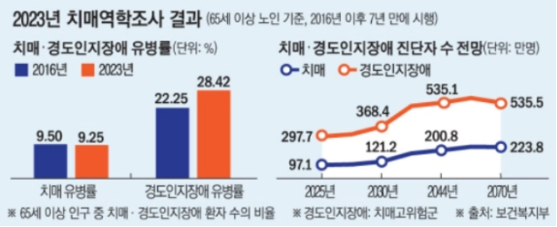
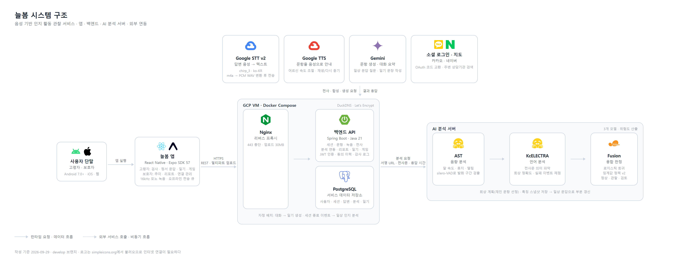

# 늘봄 (NEULBOM)

> 성장형 캐릭터 기반 치매 조기 스크리닝 서비스

늘봄은 스마트폰에서 인지검사와 음성 문답을 수행하고 그 과정에서 얻은 정보를 분석해 인지건강 변화를 살펴볼 수 있도록 돕는 보조적 스크리닝 서비스다. 고령자는 AI 캐릭터와 대화하며 검사와 기록을 진행하고, 보호자는 동의받은 범위에서 검사 결과와 인지 변화 추이를 확인한다.

**늘봄의 결과는 참고 정보이며 의학적 진단이나 확진을 대신하지 않는다.**

---

## 1. 프로젝트 배경

### 1.1. 국내외 시장 현황 및 문제점

대한민국은 2024년 12월 65세 이상 인구 비중이 20%를 넘어 초고령사회에 진입했다. 「2023년 치매역학조사 및 실태조사」에 따르면 65세 이상 인구의 치매 유병률은 9.25%, 경도인지장애 유병률은 28.42%이며 추정 치매 환자 수는 2026년 100만 명을 넘을 것으로 전망된다. 이에 따라 인지기능 저하를 조기에 확인하고 시간에 따른 변화를 살피는 관리의 필요성이 커지고 있다.



인지선별검사 CIST는 치매안심센터 등을 중심으로 활용되지만 대면 검사와 긴 검사 주기로 인해 검사 사이의 변화를 확인하기 어렵다. 결과를 총점 위주로 기록하면 답변을 시작하기까지 걸린 시간, 침묵과 망설임, 발화 속도와 같은 과정 정보도 충분히 활용되지 않는다. 피로도, 심리 상태, 청력, 주변 소음, 학력과 문해 여부 등 검사 결과에 영향을 줄 수 있는 배경 특성도 함께 고려해야 한다.

스마트폰·태블릿 보급과 함께 인지건강 관리가 모바일·웹 서비스로 확대되고 있다. 디지털 서비스는 검사 일부를 자동화하고 결과를 축적할 수 있지만 종이 검사를 그대로 화면으로 옮기는 것만으로는 작은 글자와 버튼, 복잡한 조작에 따른 고령자의 어려움이나 반복 검사에 따른 피로를 해결하기 어렵다. 고령자와 보호자, 전문기관 사이에서 결과를 안전하게 공유하고 추가 확인으로 연결하는 체계도 필요하다.

### 1.2. 필요성과 기대효과

늘봄은 기관 방문이 어렵거나 정기 검진 사이에 변화가 우려되는 고령자에게 일상 환경에서 반복적으로 상태를 확인할 수 있는 수단을 제공한다.

음성의 음향적 특징, 답변 내용, 응답 지연과 문항 수행 정보를 함께 분석하고 같은 사용자의 검사 기록을 축적해 개인 내 변화 추이를 확인하도록 설계했다. 이렇게 하면 한 번의 점수에 의존하지 않고 일시적인 결과와 지속되는 변화 신호를 살피는 데 도움을 줄 수 있다. 큰 글자와 버튼, 음성 안내와 자막, 다시 듣기 기능 및 반려 캐릭터 상호작용은 고령자의 접근성과 지속적인 참여를 지원한다.

고령자와 동의를 받은 보호자·기관 담당자가 기록과 변화 추이를 함께 살펴보고 지속적인 위험 신호가 확인될 때 치매안심센터나 의료기관의 전문검사를 고려할 수 있다.

---

## 2. 개발 목표

### 2.1. 목표 및 세부 내용

늘봄의 개발 목표는 CIST 기반 인지검사 음성 응답의 음향·언어·행동 특징을 분석해 인지기능 저하와 관련된 위험 신호를 산출하고 그 결과를 고령자와 보호자가 반복적으로 확인할 수 있는 서비스를 구현하는 것이다.

- **다중모달 분석:** AST로 음향 특징을 분석하고 STT 전사문을 KcELECTRA로 분석한다. 응답 지연과 문항별 수행 정보를 함께 구성해 Logistic Regression 기반 Fusion Model로 연속형 위험 점수를 산출한다.
- **이해하기 쉬운 결과 안내:** 점수를 '안정적', '꾸준한 관찰 필요', '확인 필요'의 3단계 안내로 제공해 추가 확인이 필요한 경우를 알린다.
- **반복 관찰과 보호자 연계:** 검사 결과와 변화 추이를 축적하고 고령자의 동의와 기능별 접근 권한에 따라 보호자 또는 기관 담당자와 공유한다.
- **고령자 친화적 검사 경험:** 큰 글자와 버튼, 음성 안내와 자막 병기, 다시 듣기를 제공하고 성장형 반려 캐릭터를 활용해 검사와 음성 문답에 참여하도록 돕는다.

### 2.2. 기존 서비스 대비 차별성

| 서비스 | 인지 선별·평가 | 음성 기반 AI 분석 | 반복 측정·변화 추적 | 보호자 연계·관리 | 반려형 캐릭터 상호작용 |
| --- | --- | --- | --- | --- | --- |
| 치매체크 | 제공 | 미확인 | 부분 제공 | 제공 | 미확인 |
| 인지케어 | 제공 | 미확인 | 제공 | 제공 | 미확인 |
| 기억탐정 | 제공 | 제공 | 제공 | 제공 | 미확인 |
| **늘봄** | 제공 | 제공 | 제공 | 제공 | 제공 |

늘봄은 음성 응답의 음향·언어 특징뿐 아니라 응답 지연과 문항 수행 정보까지 결합해 분석한다. 또한 반복 검사와 개인 내 변화 추적, 보호자·기관 연계, 고령자 친화적 화면과 성장형 반려 캐릭터를 하나의 서비스 흐름으로 구성한다. 캐릭터는 치료 효과를 제공하는 수단이 아니라 반복적인 상호작용과 서비스 참여를 돕는 사용자 경험 요소로 활용한다.

### 2.3. 사회적 가치 도입 계획

1. **고령자 이용 장벽을 낮춘다.** 큰 글자와 버튼, 음성 안내와 자막, 다시 듣기를 검사 과정에 적용한다. 도입 과정에서 고령자와 기관 담당자의 사용 의견을 확인하고 검사 중 어려움을 겪거나 중단하는 단계가 반복되면 화면과 안내 방식을 개선한다.
2. **정보 공유는 고령자의 동의를 기준으로 운영한다.** 보호자나 기관 담당자는 고령자와 연결된 경우에만 정해진 권한 범위에서 검사 기록과 변화 추이를 확인하도록 한다. 민감한 정보가 권한 밖으로 공유되지 않도록 접근 범위를 제한한다.
3. **지속적인 변화가 보이면 전문기관의 추가 확인을 안내한다.** 한 번의 점수로 상태를 단정하지 않고 반복 검사에서 나타난 변화 추이를 참고 정보로 제공한다. 늘봄이 치매를 진단하거나 치료하지 않는다는 점을 결과 화면과 안내에 명확히 표시한다.
4. **지속적으로 참여할 수 있도록 돕고 운영 방식을 개선한다.** 성장형 반려 캐릭터와 음성 상호작용을 검사 과정에 활용해 반복 참여를 돕되, 이를 치료 효과로 설명하지 않는다.

---

## 3. 시스템 설계

### 3.1. 시스템 구성도

늘봄은 앱, 백엔드, AI 분석 서버의 세 구성요소와 외부 음성·생성 AI 서비스로 이루어진다. 기기는 녹음만 담당하고 음성 인식과 분석은 서버에서 수행한다.



앱은 답변을 16kHz 모노로 녹음해 기기에 먼저 저장한 뒤 서버로 전송한다. 백엔드는 음성을 저장하고 Google STT로 전사하며, 전사문과 음성 서명 URL을 AI 서버에 넘겨 위험도를 받는다. AI 서버는 음향·언어·행동 특징을 각각 추출한 뒤 융합 모델로 연속형 위험 점수를 산출하고, 그 결과를 특징 스냅샷으로 저장해 이후 일상 문답으로 갱신한다. 모든 서비스는 하나의 GCP VM에서 Docker Compose로 구동하며 Nginx가 HTTPS를 종단한다.

### 3.2. 사용 기술

| 구분 | 기술 | 용도 |
| --- | --- | --- |
| 앱 | React Native 0.86 · Expo SDK 57 · React 19 · TypeScript | Android · iOS · 웹 단일 코드베이스 |
| 앱 | React Navigation 6 | 고령자 · 보호자 화면 전환 |
| 앱 | expo-audio · expo-file-system | 답변 녹음(16kHz 모노 AAC) · 오프라인 전송 큐 |
| 앱 | React Three Fiber · three.js · expo-gl | 성장형 3D 캐릭터(GLB 6단계) 렌더링 |
| 앱 | expo-secure-store · expo-auth-session | 토큰 보관 · 소셜 로그인 |
| 백엔드 | Spring Boot 3.5 · Java 21 | REST API 서버 |
| 백엔드 | Spring Security · OAuth2 Resource Server | JWT 인증 · 역할 및 권한 제어 |
| 백엔드 | Spring Data JPA · Flyway | 데이터 접근 · 스키마 마이그레이션 |
| 백엔드 | PostgreSQL 17 | 사용자 · 세션 · 답변 · 분석 · 일기 저장 |
| 백엔드 | springdoc-openapi | API 문서 |
| AI 서버 | FastAPI · Python 3.12 · Uvicorn | 분석 요청 처리 |
| AI 서버 | PyTorch 2.13 · Transformers | AST(음향) · KcELECTRA(언어) 추론 |
| AI 서버 | silero-vad (ONNX) | 발화 구간 검출 · 응답 지연 측정 |
| AI 서버 | scikit-learn | Fusion 로지스틱 회귀 · 임계값 정책 |
| AI 서버 | av · numpy · pandas | 오디오 디코딩 · 특징 집계 |
| 외부 API | Google Cloud Speech-to-Text v2 (chirp_3) | 답변 음성 전사 |
| 외부 API | Google Cloud Text-to-Speech | 문항 음성 안내 |
| 외부 API | Gemini | 일상 문답 문항 생성 · 대화 요약 · 일기 작성 |
| 외부 API | 카카오 · 네이버 OAuth | 소셜 로그인 |
| 외부 API | 카카오 로컬 | 주변 상담기관 검색 |
| 인프라 | GCP Compute Engine · Docker Compose · Nginx | 서비스 구동 및 HTTPS 종단 |
| 인프라 | DuckDNS · Let's Encrypt | 도메인 · 인증서 |
| 인프라 | GitHub Actions | develop 머지 시 자동 배포 |

---

## 4. 개발 결과

### 4.1. 전체 시스템 흐름도

서비스는 초기 인지검사, 일상 정서 문답, 보호자 열람의 세 흐름으로 움직인다.

**① 초기 인지검사 — 기준선 생성**

```
가입 · 동의 -> 온보딩(캐릭터 이름) -> 검사 세션 생성
 -> 문항 음성 안내(TTS) -> 답변 녹음 -> 업로드 -> 전사(STT)
 -> 답변 저장 -> [지연 회상 문항] 회상 계획 생성
 -> 재인 문항 추가 제시 -> 검사 종료 -> 종합 분석 -> 결과 화면
 -> 특징 스냅샷 저장(기준선)
```

지연 회상 문항은 분기점이다. AI 서버가 답변에서 떠올린 기억 단위(사람·이동수단·장소·시간·활동)를 판정해 놓친 항목만 재인 문항으로 추가한다. 모두 회상한 경우에는 추가 문항 없이 검사가 끝난다.

**② 일상 정서 문답 — 변화 관찰**

```
문답 시작 -> Gemini가 문항 생성 -> 음성 안내 -> 답변 녹음
 -> 업로드 -> 전사 -> 답변 저장 -> 세션 종료
 -> (자동) 일상 인지 분석: 기준선 스냅샷을 부분 갱신
 -> 추이 갱신 · 자정 배치로 대화 -> 일기 생성
```

일상 문답은 검사 기준선이 있을 때만 추이를 갱신한다. 기준선이 없으면 초기 검사를 먼저 요구한다.

**③ 보호자 열람**

```
보호자 초대 코드 발급 -> 고령자 수락 · 열람 범위 동의 -> 연결 활성
 -> 대시보드 · 인지 저하 추이 · 일기 · 활동 기록 열람
 -> 위험 신호가 이어지면 전문기관 안내
```

열람 범위는 검사 결과, 대화 요약, 일기, 활동·게임으로 나누며 고령자가 동의한 항목만 열린다.

### 4.2. 기능 설명 및 주요 기능 명세서

| 기능 | 입력 | 출력 | 설명 |
| --- | --- | --- | --- |
| 회원가입 · 로그인 | 이메일, 비밀번호, 역할(고령자·보호자) | 액세스·리프레시 토큰 | 이메일 가입과 카카오·네이버 소셜 로그인을 지원한다. 필수 약관 동의 이력을 함께 저장한다. |
| 보호자 연결 · 열람 범위 | 보호자가 발급한 초대 코드, 고령자 동의 | 연결 식별자, 열람 범위 | 코드는 유효기간과 시도 횟수가 제한된다. 검사 결과·대화 요약·일기·활동 중 고령자가 동의한 항목만 열린다. |
| 초기 인지검사 | 문항별 음성 답변 | 답변 기록, 검사 완료 상태 | CIST 기반 문항을 순서대로 제시한다. 문항은 음성으로 읽어 주고 자막과 다시 듣기를 제공하며, 외워야 할 문장은 화면에 노출하지 않는다. |
| 답변 녹음 · 업로드 | 음성 파일(16kHz 모노 AAC), 세션·문항 식별자, 녹음 길이 | 녹음 식별자, 전송 상태 | 기기에 먼저 저장해 연결이 끊겨도 답변이 유실되지 않는다. 파일 식별자로 중복 업로드를 막으며 최대 60초까지 허용한다. |
| 음성 전사 | 녹음 식별자 | 전사문, 음성 길이, 언어 | 서버가 m4a를 PCM WAV로 변환해 Google STT에 전달한다. 인식에 실패하면 다시 녹음하도록 안내한다. |
| 회상 계획 | 지연 회상 답변의 음성·전사문 | 회상한 기억 단위, 다음 제시할 재인 문항 목록 | 떠올리지 못한 항목만 선별해 물어 불필요한 문항을 줄인다. 발화가 검출되지 않으면 재시도를 요청한다. |
| CIST AI 분석 | 세션의 전체 답변 음성·전사문·응답 시간 | 위험 점수, 3단계 안내, 특징 스냅샷 | AST·KcELECTRA·응답 지연을 융합해 연속형 점수를 산출하고 임계값 정책으로 안정·관찰·확인을 구분한다. |
| 일상 정서 문답 · 추이 갱신 | 음성 답변, 종료된 문답 세션 | 문답 기록, 갱신된 위험 점수 스냅샷 | Gemini가 이전 답변을 이어받는 질문을 생성하고 CIST 문항을 섞어 제시한다. 세션이 끝나면 검사 기준선을 부분 갱신한다. |
| 일상 참여 기능 | 하루치 대화, 게임 결과 | 일기, 기록, 레벨·경험치 | 대화를 요약해 일기를 만들고 기억력 게임 결과를 기록한다. 참여할수록 캐릭터가 6단계까지 성장한다. |
| 보호자 리포트 | 연결된 고령자, 기간(3·6·12개월) | 최근 위험도, 날짜별 점수 그래프, 변화량, 알림 | 단일 점수가 아니라 개인 내 변화 추이를 보여 주며 위험 신호가 이어지면 전문기관을 안내한다. |

### 4.3. 디렉토리 구조

```
neulbom/
├─ frontend/                 고령자·보호자 앱 (React Native · Expo)
│  ├─ src/
│  │  ├─ api/               서버 통신 모듈 · 토큰 · 오류 처리
│  │  ├─ components/        공통 UI · 3D 캐릭터 · 음성 버튼
│  │  ├─ hooks/             녹음 · 음성 재생 · API 호출 훅
│  │  ├─ navigation/        화면 전환 구성
│  │  ├─ recording/         오프라인 전송 큐
│  │  ├─ screens/
│  │  │  ├─ auth/           가입 · 로그인 · 온보딩 · 기본정보
│  │  │  ├─ elder/          검사 · 정서 문답 · 일기 · 게임 · 마이
│  │  │  └─ guardian/       대시보드 · 추이 · 연결 관리 · 알림
│  │  ├─ store/             전역 상태(로그인 · 온보딩)
│  │  └─ theme/             색 · 글자 크기 · 간격
│  └─ assets/               캐릭터 모델(GLB) · 이미지 · 폰트
├─ backend/                  API 서버 (Spring Boot · Java 21)
│  ├─ src/main/java/com/neulbom/backend/
│  │  ├─ auth/              인증 · 토큰 · 소셜 로그인
│  │  ├─ user/              사용자 · 동의 · 환경 설정
│  │  ├─ session/           검사·문답 세션 · 문항 · 답변
│  │  ├─ recording/         녹음 업로드 · 저장 · 서명 URL
│  │  ├─ analysis/          전사 · AI 서버 연동 · CIST 분석
│  │  ├─ report/            대시보드 · 추이 · 보호자 리포트
│  │  ├─ diary/             일기 생성 · 열람 · 반응
│  │  ├─ game/              기억력 게임 · 캐릭터 성장
│  │  ├─ guardian/          초대 · 연결 · 열람 범위
│  │  ├─ notification/      알림
│  │  ├─ speech/            음성 합성(TTS)
│  │  ├─ counseling/        상담기관 검색
│  │  └─ config/            보안 · 외부 API 설정
│  ├─ src/main/resources/db/migration/   스키마 마이그레이션
│  └─ docs/                 API 명세 · 개발 체크리스트
├─ ai-server/                분석 서버 (FastAPI · Python)
│  ├─ app/
│  │  ├─ api/               요청·응답 스키마 · 라우트
│  │  ├─ audio/             다운로드 · 전처리 · VAD
│  │  ├─ inference/         AST · KcELECTRA · Fusion · 위험 정책
│  │  ├─ scoring/           회상 실패 · 응답 지연 · 집계
│  │  ├─ services/          분석 · 회상 계획 · 멱등 처리
│  │  ├─ contracts/         문항·채점 계약 정의
│  │  └─ repositories/      분석 이력 저장
│  └─ configs/              임계값 · VAD 설정 파일
├─ deploy/                   운영 배포 구성 (Docker Compose · Nginx)
├─ docs/                     브랜치·커밋·이슈 규약 · 연동 체크리스트
└─ scripts/                  로컬 실행 보조 스크립트
```

### 4.4. 산업체 멘토링 의견 및 반영 사항

2026년 8월 2일 검토 자문을 받았다. 주요 의견과 반영 내용은 다음과 같다.

| 멘토 의견 | 반영 내용 |
| --- | --- |
| 모델 지표를 더 끌어올리기보다 검사 녹음부터 보호자 결과 화면까지 이어지는 전체 흐름을 먼저 완성할 것 | 답변 녹음·업로드·전사·AI 분석·보호자 추이까지 이어지는 흐름을 먼저 완성하고 실기기에서 끝까지 동작하는 것을 확인했다. 모델은 계약을 고정해 두고 교체할 수 있도록 구성했다. |
| 기기에서는 녹음만 하고 STT와 분석은 서버에서 수행하는 구조가 자연스럽다 | 앱은 녹음과 전송만 담당하고 전사는 백엔드가 Google STT로 수행한다. 기기 성능에 따른 편차를 없앴다. |
| 같은 파일이 중복 전송·중복 분석되지 않도록 파일 식별자 기반 멱등 처리가 필요하다 | 녹음과 답변 저장에 클라이언트 식별자를 두어 같은 요청이 두 번 들어와도 하나로 처리된다. AI 서버도 분석 요청에 멱등 키를 적용한다. |
| 오프라인 저장 후 전송 상태를 단계별로 구분한 설계는 좋다 | 기기 저장 → 전송 대기 → 전송 완료 → 분석 완료를 그대로 구현했다. 전송에 실패한 녹음은 다시 녹음하도록 안내한다. |
| 립싱크는 검토 단계로 두고 핵심 파이프라인 완성 이후에 진행할 것 | 캐릭터 입모양 애니메이션을 모든 성장 단계에서 제거했다. 레벨별 모델 교체는 유지한다. |
| recall을 우선하면 오탐이 늘어나므로 운영 임계값은 '참고 점수'임을 강조하는 안내 문구와 함께 설계할 것 | 결과를 점수가 아닌 '안정적 · 꾸준한 관찰 필요 · 확인 필요' 3단계 안내로 제공하고, 결과 화면에 진단이 아니라 변화를 비교하기 위한 기준이라는 문구를 명시했다. 고령자 화면에는 점수를 노출하지 않는다. |
| 한 번의 점수보다 보호자 화면에 무엇을 어떻게 보여 줄지를 먼저 정할 것 | 보호자 화면을 단일 점수가 아니라 기간별 추이, 변화량, 연속 하락 횟수 중심으로 구성했다. 검사 기준선을 일상 문답으로 갱신해 개인 내 변화를 보게 했다. |
| 검사 1건당 처리 시간도 함께 측정할 것 | 실기기 녹음으로 단계별 시간을 측정했다. 업로드는 1초 내외, 전사는 5초 분량이 약 2초, 60초 분량이 약 12초였다. 이 과정에서 긴 답변의 전사가 빈 결과로 돌아오는 문제를 발견해 서버에서 WAV로 변환해 전달하도록 고쳤다. |
| 저사양 기기에서 3D 렌더링 성능을 확인하고 정적 이미지 폴백을 준비할 것 | 미반영. 현재는 로딩 표시만 있어 저사양 기기용 대체 이미지가 필요하다. |
| 음성은 민감 데이터이므로 기기 임시 저장 구간의 암호화도 검토할 것 | 미반영. 토큰은 기기 보안 저장소를 쓰지만 전송 대기 중인 녹음 파일은 암호화되지 않는다. |
| 경로당 환경에서 화자 분리 오류율을 먼저 측정할 것 | 설계 변경으로 해당 없음. 앱에서 개인이 문항별로 짧게 녹음하는 방식으로 바뀌어 화자 분리 단계가 필요 없어졌다. |

---

## 5. 설치 및 실행 방법

### 5.1. 설치절차 및 실행 방법

#### 배포 주소

https://neulbom.duckdns.org

#### APK 설치

Android 앱은 Expo EAS Build를 통해 APK 파일로 빌드하여 설치할 수 있다.

```bash
cd frontend
npm install
npx eas-cli login
npx eas-cli build:configure
npm run eas:build:android:preview
```

빌드가 완료되면 생성된 APK 파일을 Android 기기에 다운로드하여 설치한 후 실행한다.

#### 로컬 실행

**Frontend**

```bash
cd frontend
npm install
cp .env.example .env
npm start
```

`.env`의 `EXPO_PUBLIC_API_BASE_URL`에는 백엔드 주소를 설정한다.

```bash
EXPO_PUBLIC_API_BASE_URL=http://localhost:8080
```

**Backend**

PostgreSQL 실행 및 환경변수 설정 후 다음 명령으로 실행한다.

```bash
cd backend
cp .env.example .env
./gradlew bootRun --args='--spring.profiles.active=local'
```

기본 포트는 `8080`이다.

**AI Server**

Python 가상환경과 AI 모델 파일을 준비한 후 다음 명령으로 실행한다.

```bash
cd ai-server
python -m uvicorn app.main:app --host 0.0.0.0 --port 8000
```

기본 포트는 `8000`이다.

### 5.2. 오류 발생 시 해결 방법

| 오류 상황 | 해결 방법 |
| --- | --- |
| 앱에서 서버 연결 실패 | `EXPO_PUBLIC_API_BASE_URL`이 올바른 주소인지 확인 |
| 백엔드 실행 실패 | PostgreSQL 실행 여부와 `.env`의 DB 설정 확인 |
| STT 동작 실패 | Google Cloud 인증 및 STT 프로젝트 설정 확인 |
| AI 분석 실패 | AI 서버 실행 여부, 모델 파일 경로, 서비스 토큰 확인 |
| Android Emulator에서 백엔드 연결 실패 | `localhost` 대신 `10.0.2.2:8080` 사용 |
| 포트 충돌 | `8080`, `8000`, `5432` 포트를 사용 중인 프로세스 확인 |
| 운영 서버 오류 | Docker Compose 로그를 통해 각 서비스 상태 확인 |

---

## 6. 소개 자료 및 시연 영상

### 6.1. 프로젝트 소개 자료

[늘봄 프로젝트 소개 자료 (Google Slides)](https://docs.google.com/presentation/d/11qWvt2otd0U5ijl2KU0iGcvjQMmvF9uW/edit?usp=sharing&ouid=102796737423625953081&rtpof=true&sd=true)

저장소 사본: [`docs/03.발표자료/2026발표자료_21_효자손.pptx`](docs/03.발표자료/2026발표자료_21_효자손.pptx)

### 6.2. 시연 영상

[](https://youtu.be/Zer9K6fwnQw)

---

## 7. 팀 구성

### 7.1. 팀원별 소개 및 역할 분담

| 원준서 | 김민서 | 이지현 |
| --- | --- | --- |
| 프론트엔드 | 백엔드 · 기획 | AI 분석 모델 · AI 서버 · 3D 캐릭터 애니메이션 제작 |
| [@wonjunsea](https://github.com/wonjunsea) | [@oesmln](https://github.com/oesmln) | [@leejihye0n](https://github.com/leejihye0n) |

### 7.2. 팀원 별 참여 후기

**원준서**

> 가장 기억에 남는 장면은 완성된 앱을 실제 폰에 깔아 놓고 마이크 버튼을 눌렀는데 아무 일도 일어나지 않던 순간이다. 개발할 때는 분명히 잘 되던 기능이었다. 그날 이후로 "내 컴퓨터에서 되는 것"과 "사용자 손에서 되는 것"은 완전히 다른 얘기라는 걸 계속 확인하게 됐다.
>
> 프론트엔드를 맡으면서 코드보다 더 자주 고친 건 문구와 순서였다. 버튼을 어디에 둘지, 안내를 몇 글자로 줄일지, 지금 녹음 중이라는 걸 어떻게 알릴지 같은 것들이다. 처음에는 사소해 보였는데, 어르신이 쓸 화면에서는 그런 작은 결정이 검사를 끝까지 마치느냐 중간에 멈추느냐를 가른다는 걸 알게 됐다. 화면을 만드는 일이 결국 사람의 행동을 설계하는 일이라는 생각을 이때 처음 해봤다.
>
> 혼자 하는 작업이 아니라는 것도 많이 느꼈다. 앱에서 보낸 값 하나가 백엔드를 지나 AI 서버까지 가는 동안 어디서든 어긋날 수 있었고, 실제로 그런 문제가 여러 번 있었다. 원인을 찾으려면 내 코드만 봐서는 안 되고 서버가 무엇을 받았는지까지 따라가야 했다. 덕분에 팀원들과 API를 두고 이야기할 일이 많았고, 미리 맞춰 두는 게 왜 중요한지 몸으로 배웠다. 그러나 4년간 배운 것을 실제로 해보는 경험이 값지고 추후에 도움이 될 것이라 생각한다.

**김민서**

> 졸업과제를 진행하는 과정은 처음부터 쉽지 않았던 것 같다. 두루뭉술했던 주제를 실제 서비스로 구체화하는 과정에서도 많은 고민이 필요했고, 어떤 AI 모델을 사용할지, 학습은 어떻게 진행해야 할지 등 처음에는 막막했던 부분도 많았다. 심지어 원래 프로젝트에 사용하기로 계획했던 AI Hub의 데이터를 사용할 수 없게 되면서 직접 데이터를 수집해야 했다. 이후에도 모델 학습 결과가 원하는 만큼 나오지 않아 계속해서 해결 방법을 찾아야 했다.
>
> 개발도 오래 걸렸지만, 개발 이후의 배포 과정도 쉽지 않았다. 배포를 하면서 정말 많은 이슈가 있었는데…ㅎㅎ(저장소를 나눠서 사용하다 보니 저장 용량이 부족, IAP 때문에 자동배포가 안됨 등등) 이런 문제들에 계속 시달리면서 서비스가 안정적으로 돌아가는 게 얼마나 중요한지 정말 많이 배웠다. Docker도 여러 번 다루다 보니 이전보다는 훨씬 익숙해진 것 같다. 또 QA를 진행하면서 개발 중에는 발견하지 못했던 오류들이 계속 나오는 걸 보고, 개발이 끝났다고 해서 정말 끝난 게 아니라는 걸 느꼈다. 오히려 개발이 끝난 이후부터가 진짜 시작이라는 생각이 들었다.
>
> 봄부터 시작해서 가을까지 짧지 않은 시간 동안 하나의 서비스를 만들기 위해 정말 많은 고민과 노력을 했고, 그 과정에서 많은 경험과 배움을 얻어간 것 같다. 힘든 순간도 많았지만 그만큼 보람도 컸고, 오랜 시간 함께 만들어온 만큼 늘봄이라는 서비스에도 정말 애정이 생기게 된 것 같다 ㅎㅎ

**이지현**

> 기획부터 개발, QA까지 인지저하 고위험군 스크리닝 서비스를 장기간 진행하면서 가장 공을 들인 부분은 데이터였다. 공개 데이터만으로는 부족해 경로당에 직접 방문해 CIST 검사 음성을 녹음했는데 여러 어르신이 함께 계신 환경이라 검사 음성 외에 주변 대화와 생활 소음이 많이 섞여 있었다. 이를 음성 에디터로 하나하나 들으며 대상자의 발화 구간만 편집했고, 음향 특징을 분석하는 AST와 텍스트를 분석하는 KcELECTRA에 각각 어떤 길이와 형식으로 데이터를 넣어야 할지 고민했다. 처음 해보는 작업이라 시행착오가 많았지만, 논문과 자료를 찾아보며 방법을 하나씩 정해 나가는 과정이 매우 뜻깊었다.
>
> 모델의 정확도가 일정 수치 이상 오르지 않아 중간중간 지치기도 했다. 하지만 원인을 찾아가는 과정에서 문제는 모델 구조보다 데이터에 있는 경우가 많다는 것을 알게 되었고, 모델 성능만큼이나 데이터의 품질과 전처리가 중요하다는 것을 몸소 깨달았다.
>
> 또한 현장에서 어르신들과 실무자분들을 직접 만나며 실제 사용자에게는 큰 글씨와 버튼, 음성 안내 등 쓰기 쉬운 화면이 중요하다는 것을 깨닫고, 실무자의 피드백에 따라 앱을 설계할 수 있어서 좋았다. 정확도를 목표 수준까지 끌어올리지 못한 점은 아쉽지만, 생소했던 음성 AI 모델을 직접 학습시키고 이를 실제 서비스로 연결해 본 경험은 이번 과제에서 얻은 가장 큰 수확이었다.

---

## 8. 참고 문헌 및 출처

[1] Ministry of Health and Welfare and National Institute of Dementia, "2023 Korean Dementia Epidemiology Survey and Nationwide Status Survey," Sejong, Korea, 2025. (in Korean)

[2] C. H. Park, "Research on Prediction of Diagnosis Dementia Using Voice Data of Cognitive Dysfunction Patients," M.S. thesis, Dept. of Smart Factory Convergence, Graduate School, Sungkyunkwan University, Seoul, Korea, Dec. 2023. (in Korean)

[3] H. J. Kim, "Language Assessment in Dementia," Proc. of the 36th Spring Conference of the Korean Neurological Association, pp. 55-59, 2017. (in Korean)

[4] H. J. Hwang and S. Lim, "Speech-based Dementia Risk Detection Model Using BERT," Journal of the Korea Institute of Information and Communication Engineering, Vol. 29, No. 8, pp. 1009-1018, Aug. 2025. (in Korean)

[5] Y. Gong, Y.-A. Chung, and J. Glass, "AST: Audio Spectrogram Transformer," Proc. of Interspeech 2021, pp. 571-575, Aug. 2021.

[6] J. Lee, "KcELECTRA: Korean Comments ELECTRA," GitHub Repository, 2021. [Online]. Available: https://github.com/Beomi/KcELECTRA (downloaded 2026, Sep. 12)

[7] Silero Team, "Silero VAD: Pre-trained Enterprise-grade Voice Activity Detector," GitHub Repository, 2021. [Online]. Available: https://github.com/snakers4/silero-vad (downloaded 2026, Sep. 12)

[8] "MMSE-KC: Mini-Mental Status Examination in the Korean Version of the CERAD Assessment Packet (CERAD-K)," Appendix, pp. 1-2. (in Korean)
